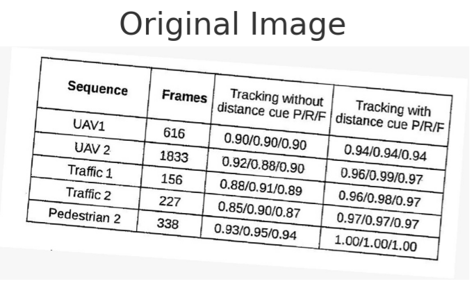

# Table Extractor

A Python module to extract tabular data from images and convert it to a structured pandas DataFrame.

## Features:

- Rotation correction for slightly rotated table images.
- Cell extraction to detect individual table cells.
- OCR processing using `pytesseract` to convert cell images to text.
- Parallel processing for faster OCR.
- Outputs a structured pandas DataFrame.



## Usage:

1. Import the main function:
   ```python
   from main import extract_to_dataframe
   
   df = extract_to_dataframe('path_to_your_image.jpg')
   print(df)```
   

## Dependencies:
    
OpenCV
pytesseract
pandas
concurrent.futures